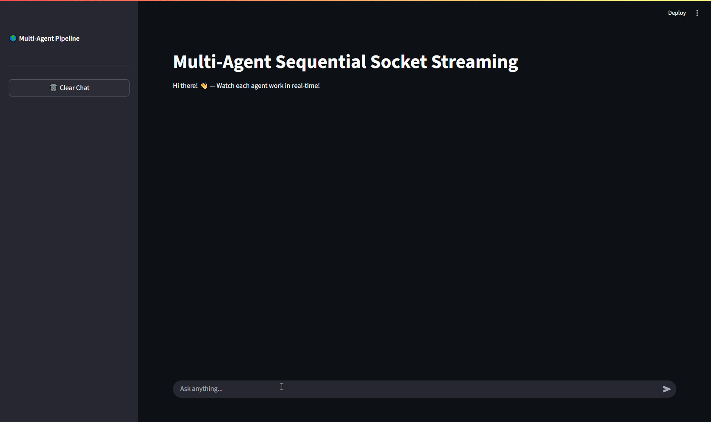

# Multi-Agent Code Generation Pipeline

A sequential multi-agent system that generates, reviews, and refactors Python code using Google's Agent Development Kit (ADK). The system consists of three specialized agents working in sequence to produce high-quality Python code from natural language specifications.



## 🏗️ Architecture

The pipeline consists of three sequential agents:

1. **CodeWriterAgent** - Generates initial Python code from user specifications
2. **CodeReviewerAgent** - Reviews the generated code and provides feedback
3. **CodeRefactorerAgent** - Refactors the code based on review comments

## 🚀 Features

- **Sequential Agent Pipeline**: Three specialized agents work in sequence
- **Real-time Streaming**: Watch each agent work live through the Streamlit interface
- **Session Management**: Maintains conversation context across interactions
- **Multiple Endpoints**: Both streaming (`/ask_stream`) and non-streaming (`/ask`) API endpoints
- **Dual Model Support**: Configurable to use both Gemini and local Ollama models
- **Interactive Web UI**: Clean Streamlit interface with live updates
- **Comprehensive OpenAPI Documentation**: Full Swagger UI with detailed endpoint documentation
- **Modular Architecture**: Clean separation of concerns with dedicated modules for agents, API, models, and config
- **Health Check Endpoints**: Built-in health monitoring and status reporting

## 📋 Prerequisites

- Python 3.10-3.12
- [uv](https://docs.astral.sh/uv/) package manager
- Google Gemini API access
- Ollama server (for local model support)

## 🛠️ Installation

1. **Clone the repository**
   ```bash
   git clone <repository-url>
   cd multi-agent
   ```

2. **Install dependencies**
   ```bash
   uv sync
   ```

3. **Set up environment variables**
   Create a `.env` file in the `multi-agent/` directory:
   ```env
   GEMINI_API_KEY=your_gemini_api_key_here
   OLLAMA_API_BASE=http://localhost:11434
   PYTHONUTF8=1
   ```

## 🏃 Usage

### Option 1: Run Both Services

1. **Start the FastAPI backend** (Terminal 1):
   ```bash
   uv run python multi-agent/agent.py
   ```
   The API will be available at `http://localhost:8001`

2. **Start the Streamlit frontend** (Terminal 2):
   ```bash
   uv run streamlit run multi-agent/app.py
   ```
   The web interface will be available at `http://localhost:8501`

### Option 3: Explore the API Documentation

Once the FastAPI backend is running, you can explore the comprehensive API documentation:

- **Swagger UI**: `http://localhost:8001/docs` - Interactive API explorer
- **ReDoc**: `http://localhost:8001/redoc` - Clean API documentation
- **OpenAPI JSON**: `http://localhost:8001/openapi.json` - Raw OpenAPI specification

### Option 4: Use API Directly

You can also interact with the API directly:

**Streaming endpoint:**
```bash
curl -X POST "http://localhost:8001/ask_stream" \
     -H "Content-Type: application/json" \
     -d '{"query": "Create a function to calculate fibonacci numbers"}'
```

**Non-streaming endpoint:**
```bash
curl -X POST "http://localhost:8001/ask" \
     -H "Content-Type: application/json" \
     -d '{"query": "Create a function to calculate fibonacci numbers"}'
```

## 🎯 Example Usage

1. Open the Streamlit interface at `http://localhost:8501`
2. Enter a code request like: "Create a function to validate email addresses"
3. Watch as each agent processes your request:
   - **Writer**: Generates the initial code
   - **Reviewer**: Analyzes and provides feedback
   - **Refactorer**: Improves the code based on feedback
4. Get the final, refined Python code

## 📊 API Endpoints

The API provides comprehensive OpenAPI documentation with interactive examples at `http://localhost:8001/docs`.

### Core Endpoints

### `POST /ask_stream` (Streaming)
Streams agent responses in real-time as JSON chunks - ideal for interactive applications.

**Request:**
```json
{
  "query": "your code request",
  "user_id": "optional_user_id",
  "session_id": "optional_session_id"
}
```

**Response:** Streaming JSON chunks with agent progress

### `POST /ask` (Standard)
Returns complete agent pipeline results - ideal for API integrations.

**Request:** Same as `/ask_stream`

**Response:**
```json
{
  "responses": ["final responses from agents"],
  "session_id": "session_identifier"
}
```

### Health Check Endpoints

### `GET /` 
Simple health check to verify API availability.

### `GET /health`
Detailed health status with agent and service information.

## ⚙️ Configuration

### Model Configuration

The system supports **dual model configuration** - you can choose between cloud-based Gemini or local LLM via LiteLLM:

#### Option 1: Google Gemini (Cloud)
- **Pros**: High-quality responses, no local setup required
- **Cons**: Requires API key, external dependency, potential costs
- **Setup**: Set `GEMINI_API_KEY` in your `.env` file

#### Option 2: Local LLM via Ollama (Local)  
- **Pros**: No API costs, runs locally, privacy-focused
- **Cons**: Requires local Ollama setup, hardware requirements
- **Setup**: Run Ollama server with your preferred model

### Configuration in `multi-agent/config/settings.py`:

```python
# Model configuration for Gemini (cloud option)
MODEL = "gemini-2.5-flash"

# Model configuration for LiteLLM/Ollama (local option - currently active)
MODEL_CONFIG = LiteLlm(
    "openai/llama3.2:1b",              # Ollama model name
    api_base="http://192.168.237.77:11434/v1",  # Ollama server URL
    api_key="placeholder"               # Not used for local Ollama
)
```

**Note**: Currently configured to use the **local Ollama setup**. The agents use `MODEL_CONFIG` (LiteLLM) rather than `MODEL` (Gemini). To switch to Gemini, you'll need to modify the agent definitions to use `MODEL` instead of `MODEL_CONFIG`.

### Environment Variables

| Variable | Description | Required For | Default |
|----------|-------------|--------------|---------|
| `GEMINI_API_KEY` | Google Gemini API key | Gemini usage | Required if using Gemini |
| `OLLAMA_API_BASE` | Ollama server URL | Local LLM usage | `http://localhost:11434` |
| `PYTHONUTF8` | Enable UTF-8 encoding | Both | `1` |

### Switching Between Models

**To use Gemini (cloud)**:
1. Set `GEMINI_API_KEY` in your `.env` file
2. Modify agent files to use `MODEL` instead of `MODEL_CONFIG`
3. Update imports in agent files to use Google's model classes

**To use local LLM (current setup)**:
1. Install and run Ollama: `ollama serve`
2. Pull your desired model: `ollama pull llama3.2:1b`  
3. Update `OLLAMA_API_BASE` in `.env` if using different host/port
4. Current setup uses `MODEL_CONFIG` (already configured)

## 🧪 Development

### Running Tests
```bash
uv run pytest
```

### Code Linting
```bash
uv run ruff check
uv run ruff format
```

### Type Checking
```bash
uv run mypy .
```

## 📁 Project Structure

```
multi-agent/
├── multi-agent/                    # Main application package
│   ├── __init__.py                 # Package initialization
│   ├── agent.py                    # 🚀 FastAPI application entry point (91 lines)
│   ├── app.py                      # 🎨 Streamlit frontend interface
│   ├── .env                        # 🔐 Environment variables (not in repo)
│   ├── agents/                     # 🤖 Agent definitions
│   │   ├── __init__.py
│   │   ├── code_writer.py          # Code generation agent
│   │   ├── code_reviewer.py        # Code review agent
│   │   ├── code_refactorer.py      # Code refactoring agent
│   │   └── pipeline.py             # Sequential pipeline orchestrator
│   ├── api/                        # 🔗 API endpoints and handlers
│   │   ├── __init__.py
│   │   ├── endpoints.py            # FastAPI route definitions
│   │   └── helpers.py              # API utility functions
│   ├── models/                     # 📋 Pydantic data models
│   │   ├── __init__.py
│   │   └── api_models.py           # Request/response models
│   └── config/                     # ⚙️ Configuration management
│       ├── __init__.py
│       └── settings.py             # App settings and model config
├── pyproject.toml                  # 📦 Project configuration and dependencies
└── README.md                       # 📖 Project documentation
```

### Architecture Benefits

- **🎯 Separation of Concerns**: Each module has a single responsibility
- **📦 Modular Design**: Easy to extend, test, and maintain individual components  
- **🔄 Reusable Components**: Agents and models can be imported and used independently
- **📚 Clear Documentation**: OpenAPI specs with comprehensive endpoint documentation
- **🧪 Testable**: Modular structure makes unit testing straightforward

## 🤝 Contributing

1. Fork the repository
2. Create a feature branch
3. Make your changes
4. Run tests and linting
5. Submit a pull request

## 📄 License

This project is licensed under the MIT License.

## 🔧 Troubleshooting

**Common Issues:**

1. **Port conflicts**: Ensure ports 8001 (FastAPI) and 8501 (Streamlit) are available
2. **API key issues**: Verify your Gemini API key is correctly set in `.env`
3. **Ollama connection**: Ensure Ollama server is running if using local models
4. **Dependencies**: Run `uv sync` to ensure all dependencies are installed

**Logs**: Check the FastAPI backend logs for detailed error information.